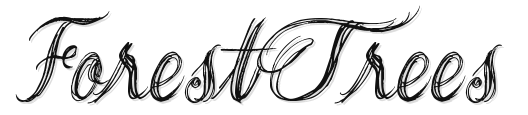

### Hi there 👋

#### About me
- 🔭 I’m currently a student.
- 🌱 I’m currently learning Python, Machine Learning and Java.
- 👯 **Minecraft** is my favorite game and I have my own Minecraft server.[Here is the official website of the server](http://minecraft.leviosa.top/)
- 😄 I am planning to develop some plugins for Minecraft server and build an official website for the server.
- 🎻 I like a singer named Mao Buyi very much.

#### Something else
- I have severe obsessive-compulsive disorder for code and like strict code specifications.
- I am still a beginner in every field. But trying to improve.

#### My Github analysis
|  |  |
| -- | -- |

<!--
**ForestTrees/ForestTrees** is a ✨ _special_ ✨ repository because its `README.md` (this file) appears on your GitHub profile.

Here are some ideas to get you started:

- 🔭 I’m currently working on ...
- 🌱 I’m currently learning ...
- 👯 I’m looking to collaborate on ...
- 🤔 I’m looking for help with ...
- 💬 Ask me about ...
- 📫 How to reach me: ...
- 😄 Pronouns: ...
- ⚡ Fun fact: ...
-->
